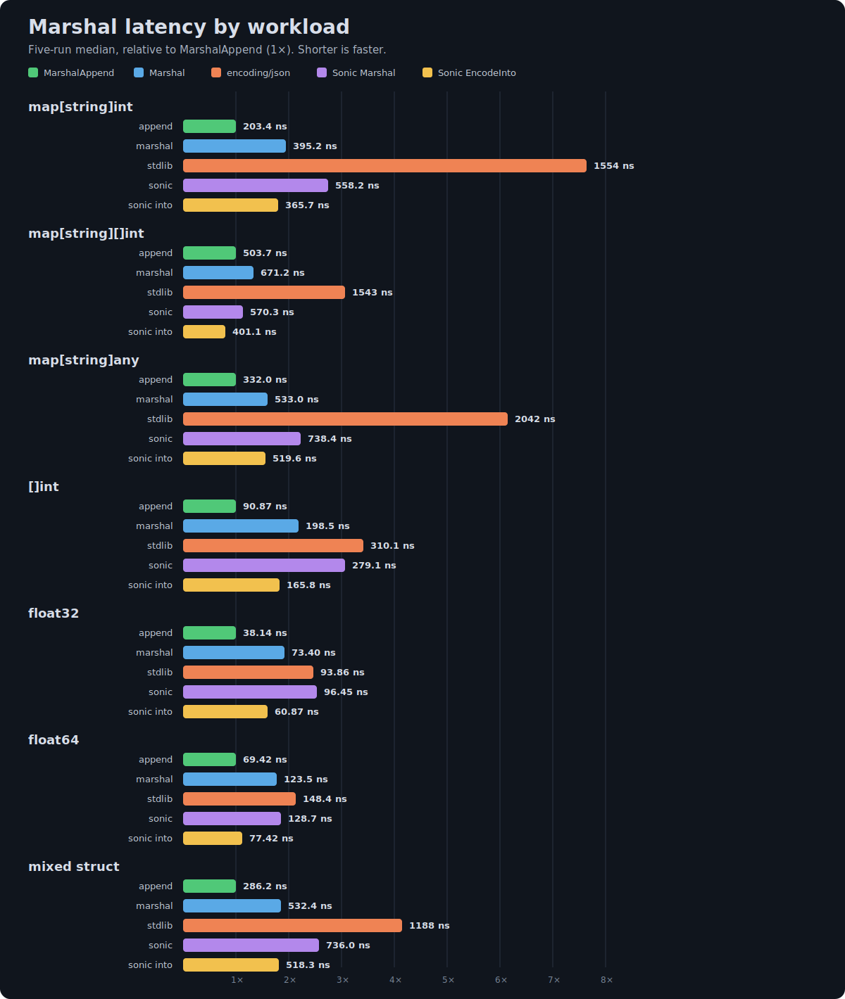

# json-experiment

An experimental, performance-focused JSON marshaler for Go.

## Benchmarks

The benchmarks compare `MarshalAppend`, `Marshal`, `encoding/json`,
`sonic.ConfigFastest`, and Sonic's reusable-buffer `EncodeInto` API.
`MarshalAppend` and `EncodeInto` reuse caller-provided destination capacity;
the other marshal APIs return an owned byte slice.

### Benchmark 2: improved SIMD string encoding

Benchmark 2 was recorded after improving the SIMD string-escaping path. It
keeps SIMD setup outside the scanning loop, processes escape masks directly,
and retains the scalar fast path for short strings. Consequently, it should
not be treated as a direct rerun of Benchmark 1: string-heavy workloads also
measure those encoder improvements. This run additionally includes Sonic's
reusable-buffer `EncodeInto` API and reports the median of five rounds.



```sh
GOAMD64=v3 GOEXPERIMENT=simd,nojsonv2 go test -benchmem -run='^$' -count=5 -bench='^(BenchmarkMarshalMapInt|BenchmarkMarshalMapIntSlice|BenchmarkMarshalMapAny|BenchmarkMarshalIntSlice|BenchmarkMarshalFloat32|BenchmarkMarshalFloat64|BenchmarkMarshalStruct)$'
```

Five-run median latency (lower is better):

| Workload | MarshalAppend | Marshal | encoding/json | Sonic Marshal | Sonic EncodeInto |
|---|---:|---:|---:|---:|---:|
| `map[string]int` | 203.4 ns | 395.2 ns | 1554 ns | 558.2 ns | 365.7 ns |
| `map[string][]int` | 503.7 ns | 671.2 ns | 1543 ns | 570.3 ns | 401.1 ns |
| `map[string]any` | 332.0 ns | 533.0 ns | 2042 ns | 738.4 ns | 519.6 ns |
| `[]int` | 90.87 ns | 198.5 ns | 310.1 ns | 279.1 ns | 165.8 ns |
| `float32` | 38.14 ns | 73.40 ns | 93.86 ns | 96.45 ns | 60.87 ns |
| `float64` | 69.42 ns | 123.5 ns | 148.4 ns | 128.7 ns | 77.42 ns |
| mixed struct | 286.2 ns | 532.4 ns | 1188 ns | 736.0 ns | 518.3 ns |

The complete five-run output, including bytes and allocations per operation,
is available in [`bench.txt`](bench.txt).

### Earlier single-run results

Benchmark 1 predates the improved SIMD string path and does not include
Sonic's `EncodeInto` API.


```text
goos: linux
goarch: amd64
pkg: github.com/33TU/json-experiment
cpu: 13th Gen Intel(R) Core(TM) i9-13900H
BenchmarkMarshalMapInt/marshal_append-20             5745892       204.7 ns/op       0 B/op       0 allocs/op
BenchmarkMarshalMapInt/marshal-20                    2665389       446.2 ns/op     144 B/op       1 allocs/op
BenchmarkMarshalMapInt/encoding_json-20               986754        1223 ns/op     232 B/op      11 allocs/op
BenchmarkMarshalMapInt/sonic_json-20                 1665478       694.8 ns/op     263 B/op       3 allocs/op
BenchmarkMarshalMapIntSlice/marshal_append-20        2483307       483.4 ns/op      40 B/op       2 allocs/op
BenchmarkMarshalMapIntSlice/marshal-20               1501316       774.2 ns/op     200 B/op       3 allocs/op
BenchmarkMarshalMapIntSlice/encoding_json-20          701028        1713 ns/op     352 B/op      10 allocs/op
BenchmarkMarshalMapIntSlice/sonic_json-20            1660813       729.9 ns/op     278 B/op       3 allocs/op
BenchmarkMarshalMapAny/marshal_append-20             3606662       327.6 ns/op       0 B/op       0 allocs/op
BenchmarkMarshalMapAny/marshal-20                    2177620       601.0 ns/op     160 B/op       1 allocs/op
BenchmarkMarshalMapAny/encoding_json-20               349639        2888 ns/op     448 B/op      23 allocs/op
BenchmarkMarshalMapAny/sonic_json-20                 1236027       986.8 ns/op     279 B/op       3 allocs/op
BenchmarkMarshalIntSlice/marshal_append-20          12649024       86.01 ns/op       0 B/op       0 allocs/op
BenchmarkMarshalIntSlice/marshal-20                  5161215       245.1 ns/op      80 B/op       1 allocs/op
BenchmarkMarshalIntSlice/encoding_json-20            3107413       475.0 ns/op     128 B/op       3 allocs/op
BenchmarkMarshalIntSlice/sonic_json-20               3672754       318.8 ns/op     127 B/op       3 allocs/op
BenchmarkMarshalFloat32/marshal_append-20           28988560       36.28 ns/op       0 B/op       0 allocs/op
BenchmarkMarshalFloat32/marshal-20                  16656058       65.59 ns/op       8 B/op       1 allocs/op
BenchmarkMarshalFloat32/encoding_json-20             8713119       142.7 ns/op      16 B/op       2 allocs/op
BenchmarkMarshalFloat32/sonic_json-20               13785015       106.1 ns/op      24 B/op       2 allocs/op
BenchmarkMarshalFloat64/marshal_append-20           19730574       56.91 ns/op       0 B/op       0 allocs/op
BenchmarkMarshalFloat64/marshal-20                  11676784       121.6 ns/op      24 B/op       1 allocs/op
BenchmarkMarshalFloat64/encoding_json-20             5733645       200.0 ns/op      32 B/op       2 allocs/op
BenchmarkMarshalFloat64/sonic_json-20                7605076       154.3 ns/op      41 B/op       2 allocs/op
BenchmarkMarshalStruct/marshal_append-20             4307013       273.2 ns/op       0 B/op       0 allocs/op
BenchmarkMarshalStruct/marshal-20                    2137054       604.5 ns/op     240 B/op       1 allocs/op
BenchmarkMarshalStruct/encoding_json-20               709479        1742 ns/op     464 B/op       7 allocs/op
BenchmarkMarshalStruct/sonic_json-20                 1421000       876.8 ns/op     448 B/op       4 allocs/op
PASS
ok      github.com/33TU/json-experiment  33.928s
```

Results vary by hardware, Go version, and workload. Run the benchmarks on the
target system before drawing conclusions for a particular application.
