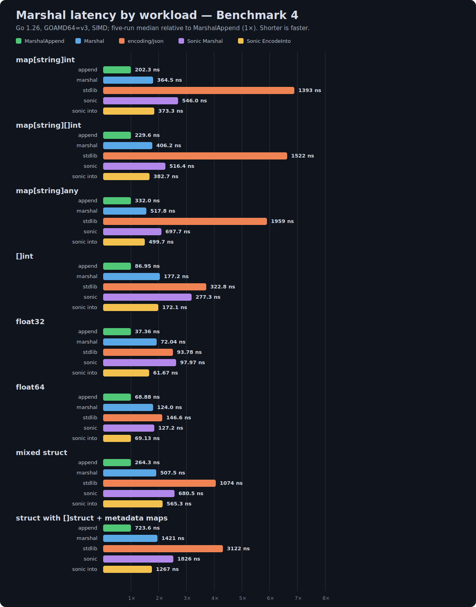
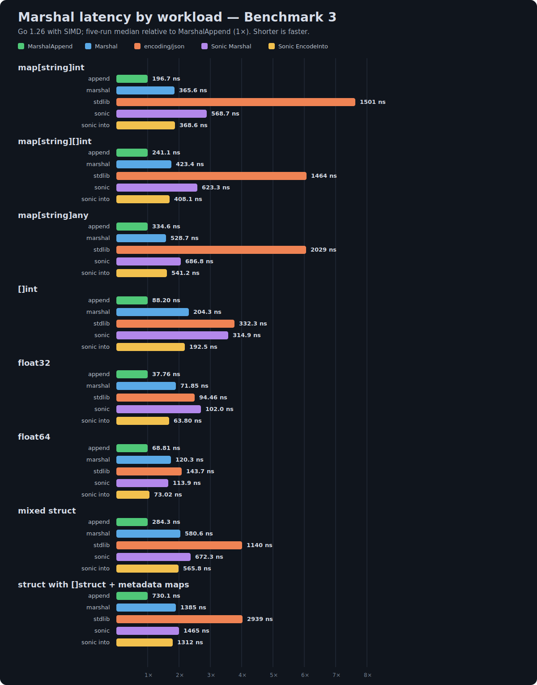
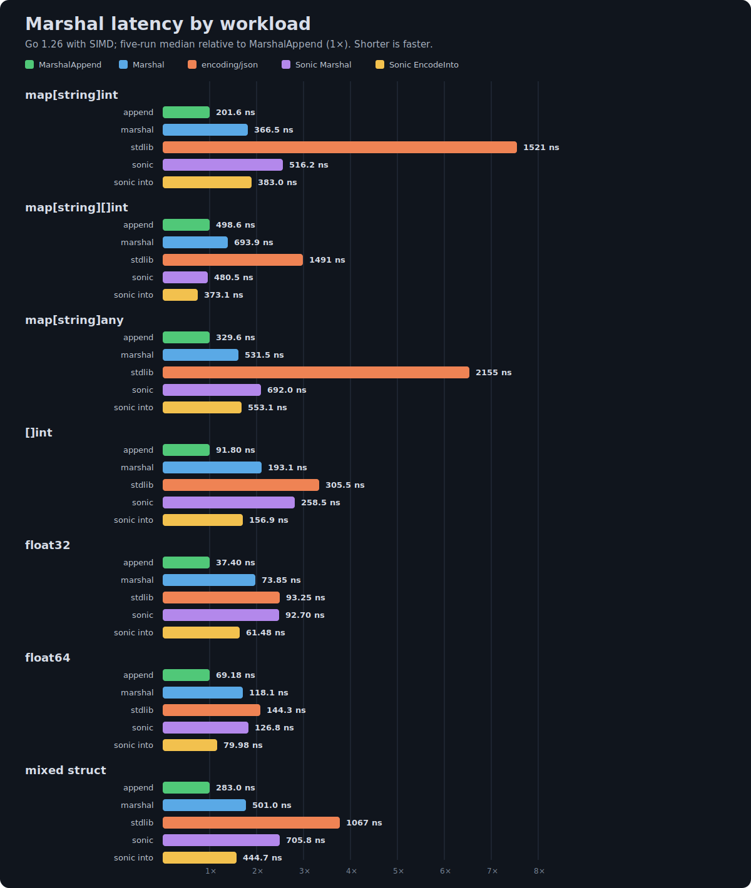
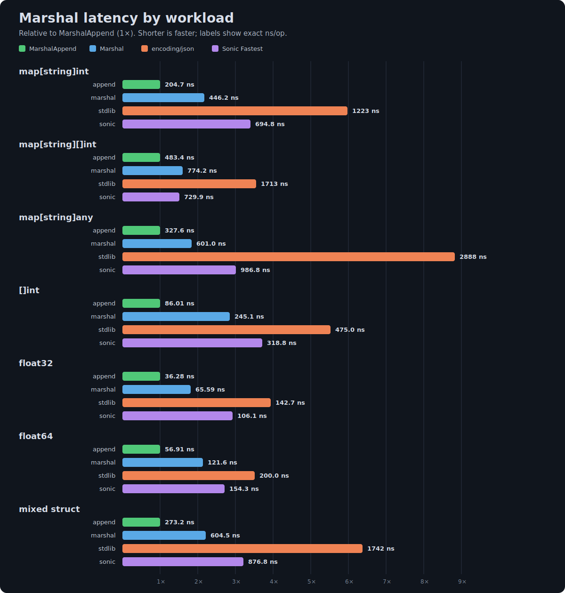

# json-experiment

An experimental, performance-focused JSON marshaler for Go.

## Benchmarks

The benchmarks compare `MarshalAppend`, `Marshal`, `encoding/json`,
`sonic.ConfigFastest`, and Sonic's reusable-buffer `EncodeInto` API.
`MarshalAppend` and `EncodeInto` reuse caller-provided destination capacity;
the other marshal APIs return an owned byte slice.

For like-for-like comparisons, `MarshalAppend` corresponds to Sonic's
`EncodeInto`, while `Marshal` corresponds to `sonic.ConfigFastest.Marshal`.
The append-style APIs can avoid the output allocation when the destination has
enough capacity; the marshal-style APIs must return independently owned output.

### Benchmark 4: current SIMD and SWAR string paths

Benchmark 4 records the current implementation after separating string
encoding into SIMD and SWAR files. SIMD builds process 16-byte chunks, while
builds without the SIMD experiment use an eight-byte SWAR scanner. This run
uses the SIMD path; it is a fresh end-to-end baseline rather than an isolated
measurement of the SWAR fallback. Results are five-run medians on Go 1.26.



```sh
GOAMD64=v3 GOEXPERIMENT=simd go test -benchmem -run='^$' -count=5 -bench='^(BenchmarkMarshalMapInt|BenchmarkMarshalMapIntSlice|BenchmarkMarshalMapAny|BenchmarkMarshalIntSlice|BenchmarkMarshalFloat32|BenchmarkMarshalFloat64|BenchmarkMarshalStruct|BenchmarkMarshalStructSlice)$'
```

| Workload | MarshalAppend | Marshal | encoding/json | Sonic Marshal | Sonic EncodeInto |
|---|---:|---:|---:|---:|---:|
| `map[string]int` | 202.3 ns | 364.5 ns | 1393 ns | 546.0 ns | 373.3 ns |
| `map[string][]int` | 229.6 ns | 406.2 ns | 1522 ns | 516.4 ns | 382.7 ns |
| `map[string]any` | 332.0 ns | 517.8 ns | 1959 ns | 697.7 ns | 499.7 ns |
| `[]int` | 86.95 ns | 177.2 ns | 322.8 ns | 277.3 ns | 172.1 ns |
| `float32` | 37.36 ns | 72.04 ns | 93.78 ns | 97.97 ns | 61.67 ns |
| `float64` | 68.88 ns | 124.0 ns | 146.6 ns | 127.2 ns | 69.13 ns |
| mixed struct | 264.3 ns | 507.5 ns | 1074 ns | 680.5 ns | 565.3 ns |
| struct with `[]struct` and metadata maps | 723.6 ns | 1421 ns | 3122 ns | 1826 ns | 1267 ns |

Median allocations per operation:

| Workload | MarshalAppend | Marshal | encoding/json | Sonic Marshal | Sonic EncodeInto |
|---|---:|---:|---:|---:|---:|
| `map[string]int` | 0 | 1 | 16 | 3 | 2 |
| `map[string][]int` | 0 | 1 | 14 | 3 | 2 |
| `map[string]any` | 0 | 1 | 18 | 3 | 2 |
| `[]int` | 0 | 1 | 2 | 3 | 2 |
| `float32` | 0 | 1 | 1 | 2 | 1 |
| `float64` | 0 | 1 | 1 | 2 | 1 |
| mixed struct | 0 | 1 | 7 | 4 | 3 |
| struct with `[]struct` and metadata maps | 0 | 1 | 22 | 7 | 6 |

The complete Benchmark 4 output, including bytes and allocations per
operation, is available in [`bench4.txt`](assets/benchmarks/raw/bench4.txt).

### Benchmark 3: specialized primitive-slice maps

Benchmark 3 adds direct appenders for maps whose values are primitive slices,
compacts cached struct-field metadata, and adds a nested struct-slice workload
where every item contains a metadata map. The results are five-run medians on
Go 1.26 with the SIMD experiment enabled.



```sh
GOAMD64=v3 GOEXPERIMENT=simd go test -benchmem -run='^$' -count=5 -bench='^(BenchmarkMarshalMapInt|BenchmarkMarshalMapIntSlice|BenchmarkMarshalMapAny|BenchmarkMarshalIntSlice|BenchmarkMarshalFloat32|BenchmarkMarshalFloat64|BenchmarkMarshalStruct|BenchmarkMarshalStructSlice)$'
```

| Workload | MarshalAppend | Marshal | encoding/json | Sonic Marshal | Sonic EncodeInto |
|---|---:|---:|---:|---:|---:|
| `map[string]int` | 196.7 ns | 365.6 ns | 1501 ns | 568.7 ns | 368.6 ns |
| `map[string][]int` | 241.1 ns | 423.4 ns | 1464 ns | 623.3 ns | 408.1 ns |
| `map[string]any` | 334.6 ns | 528.7 ns | 2029 ns | 686.8 ns | 541.2 ns |
| `[]int` | 88.20 ns | 204.3 ns | 332.3 ns | 314.9 ns | 192.5 ns |
| `float32` | 37.76 ns | 71.85 ns | 94.46 ns | 102.0 ns | 63.80 ns |
| `float64` | 68.81 ns | 120.3 ns | 143.7 ns | 113.9 ns | 73.02 ns |
| mixed struct | 284.3 ns | 580.6 ns | 1140 ns | 672.3 ns | 565.8 ns |
| struct with `[]struct` and metadata maps | 730.1 ns | 1385 ns | 2939 ns | 1465 ns | 1312 ns |

Median allocations per operation:

| Workload | MarshalAppend | Marshal | encoding/json | Sonic Marshal | Sonic EncodeInto |
|---|---:|---:|---:|---:|---:|
| `map[string]int` | 0 | 1 | 16 | 3 | 2 |
| `map[string][]int` | 0 | 1 | 14 | 3 | 2 |
| `map[string]any` | 0 | 1 | 18 | 3 | 2 |
| `[]int` | 0 | 1 | 2 | 3 | 2 |
| `float32` | 0 | 1 | 1 | 2 | 1 |
| `float64` | 0 | 1 | 1 | 2 | 1 |
| mixed struct | 0 | 1 | 7 | 4 | 3 |
| struct with `[]struct` and metadata maps | 0 | 1 | 22 | 7 | 6 |

The complete Benchmark 3 output, including bytes and allocations per
operation, is available in [`bench3.txt`](assets/benchmarks/raw/bench3.txt).

### Benchmark 2: improved SIMD string encoding

Benchmark 2 was recorded after improving the SIMD string-escaping path. It
keeps SIMD setup outside the scanning loop, processes escape masks directly,
and retains the scalar fast path for short strings. Consequently, it should
not be treated as a direct rerun of Benchmark 1: string-heavy workloads also
measure those encoder improvements. This run additionally includes Sonic's
reusable-buffer `EncodeInto` API, uses Go 1.26's default JSON implementation,
and reports the median of five rounds.



```sh
GOAMD64=v3 GOEXPERIMENT=simd go test -benchmem -run='^$' -count=5 -bench='^(BenchmarkMarshalMapInt|BenchmarkMarshalMapIntSlice|BenchmarkMarshalMapAny|BenchmarkMarshalIntSlice|BenchmarkMarshalFloat32|BenchmarkMarshalFloat64|BenchmarkMarshalStruct)$'
```

Five-run median latency (lower is better):

| Workload | MarshalAppend | Marshal | encoding/json | Sonic Marshal | Sonic EncodeInto |
|---|---:|---:|---:|---:|---:|
| `map[string]int` | 201.6 ns | 366.5 ns | 1521 ns | 516.2 ns | 383.0 ns |
| `map[string][]int` | 498.6 ns | 693.9 ns | 1491 ns | 480.5 ns | 373.1 ns |
| `map[string]any` | 329.6 ns | 531.5 ns | 2155 ns | 692.0 ns | 553.1 ns |
| `[]int` | 91.80 ns | 193.1 ns | 305.5 ns | 258.5 ns | 156.9 ns |
| `float32` | 37.40 ns | 73.85 ns | 93.25 ns | 92.70 ns | 61.48 ns |
| `float64` | 69.18 ns | 118.1 ns | 144.3 ns | 126.8 ns | 79.98 ns |
| mixed struct | 283.0 ns | 501.0 ns | 1067 ns | 705.8 ns | 444.7 ns |

Median allocations per operation:

| Workload | MarshalAppend | Marshal | encoding/json | Sonic Marshal | Sonic EncodeInto |
|---|---:|---:|---:|---:|---:|
| `map[string]int` | 0 | 1 | 16 | 3 | 2 |
| `map[string][]int` | 2 | 3 | 14 | 3 | 2 |
| `map[string]any` | 0 | 1 | 18 | 3 | 2 |
| `[]int` | 0 | 1 | 2 | 3 | 2 |
| `float32` | 0 | 1 | 1 | 2 | 1 |
| `float64` | 0 | 1 | 1 | 2 | 1 |
| mixed struct | 0 | 1 | 7 | 4 | 3 |

The complete five-run output, including bytes and allocations per operation,
is available in [`bench2.txt`](assets/benchmarks/raw/bench2.txt).

### Earlier single-run results

Benchmark 1 predates the improved SIMD string path and does not include
Sonic's `EncodeInto` API, is available in [`bench1.txt`](assets/benchmarks/raw/bench1.txt).



---

Results vary by hardware, Go version, and workload. Run the benchmarks on the
target system before drawing conclusions for a particular application.
