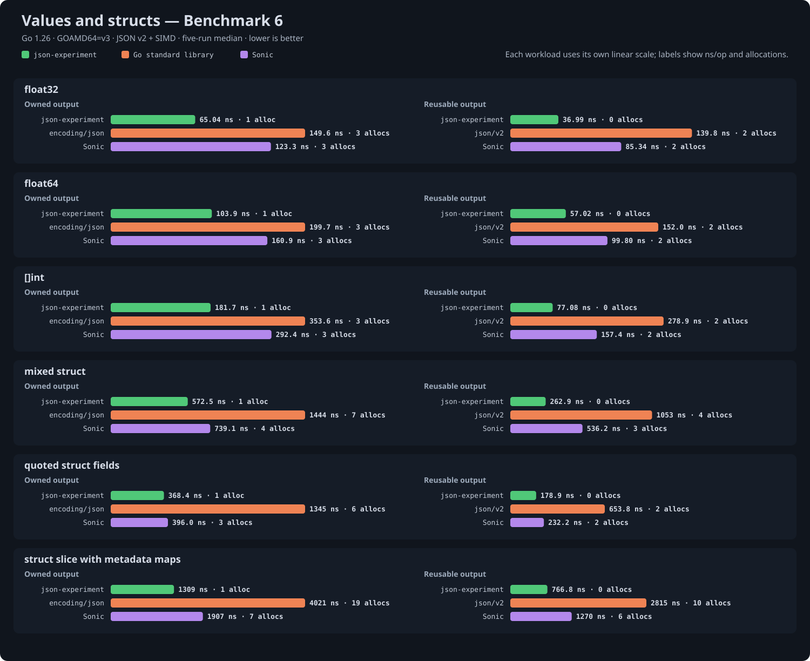
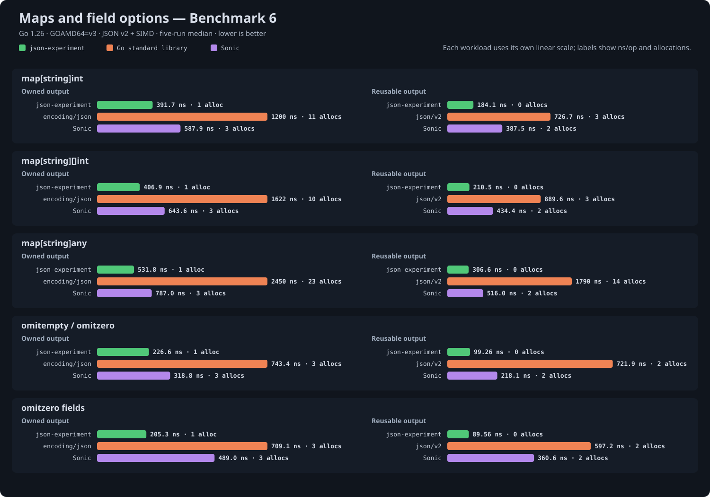
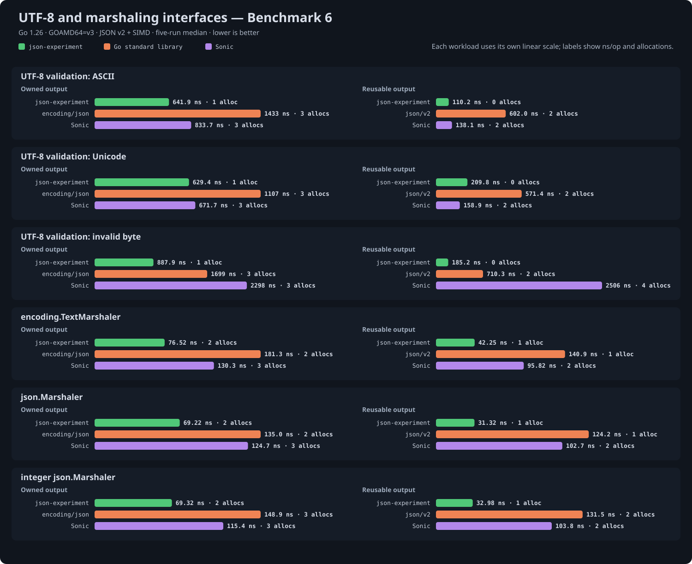
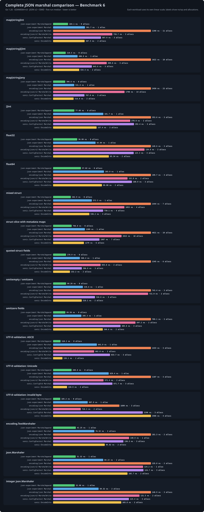

# json-experiment

An experimental, performance-focused JSON marshaler for Go.

## Benchmarks

Benchmark 6 compares matching output-ownership contracts:

- Owned output: `Marshal`, Go's `encoding/json`, and
  `sonic.ConfigFastest.Marshal`.
- Reusable output: `MarshalAppend`, Go's experimental `encoding/json/v2`
  using `MarshalWrite`, and Sonic's `EncodeInto` API.

The append path can avoid output allocation when the destination has sufficient
capacity. The charts show owned and reusable APIs side by side, but scale each
workload independently so both small values and large composite values remain
readable. Exact median latency and allocation counts are printed on every bar.

### Benchmark 6

This is a five-run median on Go 1.26 using `GOAMD64=v3` with the JSON v2 and
SIMD experiments enabled. The suite includes maps, primitive slices, numbers,
struct variants, UTF-8 validation, and standard marshaling interfaces.

#### Values and structs



#### Maps and field options



#### UTF-8 and marshaling interfaces



```sh
just bench
```

Five-run median latency for owned-output APIs (lower is better):

| Workload | Marshal | encoding/json | Sonic Marshal |
|---|---:|---:|---:|
| `map[string]int` | 391.7 ns | 1200 ns | 587.9 ns |
| `map[string][]int` | 406.9 ns | 1622 ns | 643.6 ns |
| `map[string]any` | 531.8 ns | 2450 ns | 787.0 ns |
| `[]int` | 181.7 ns | 353.6 ns | 292.4 ns |
| `float32` | 65.04 ns | 149.6 ns | 123.3 ns |
| `float64` | 103.9 ns | 199.7 ns | 160.9 ns |
| mixed struct | 572.5 ns | 1444 ns | 739.1 ns |
| struct slice with metadata maps | 1309 ns | 4021 ns | 1907 ns |
| quoted struct fields | 368.4 ns | 1345 ns | 396.0 ns |
| `omitempty` / `omitzero` | 226.6 ns | 743.4 ns | 318.8 ns |
| `omitzero` fields | 205.3 ns | 709.1 ns | 489.0 ns |
| UTF-8 validation: ASCII | 641.9 ns | 1433 ns | 833.7 ns |
| UTF-8 validation: Unicode | 629.4 ns | 1107 ns | 671.7 ns |
| UTF-8 validation: invalid byte | 887.9 ns | 1699 ns | 2298 ns |
| `encoding.TextMarshaler` | 76.52 ns | 181.3 ns | 130.3 ns |
| `json.Marshaler` | 69.22 ns | 135.0 ns | 124.7 ns |
| integer `json.Marshaler` | 69.32 ns | 148.9 ns | 115.4 ns |

Five-run median latency for reusable-output APIs (lower is better):

| Workload | MarshalAppend | json/v2 Write | Sonic EncodeInto |
|---|---:|---:|---:|
| `map[string]int` | 184.1 ns | 726.7 ns | 387.5 ns |
| `map[string][]int` | 210.5 ns | 889.6 ns | 434.4 ns |
| `map[string]any` | 306.6 ns | 1790 ns | 516.0 ns |
| `[]int` | 77.08 ns | 278.9 ns | 157.4 ns |
| `float32` | 36.99 ns | 139.8 ns | 85.34 ns |
| `float64` | 57.02 ns | 152.0 ns | 99.80 ns |
| mixed struct | 262.9 ns | 1053 ns | 536.2 ns |
| struct slice with metadata maps | 766.8 ns | 2815 ns | 1270 ns |
| quoted struct fields | 178.9 ns | 653.8 ns | 232.2 ns |
| `omitempty` / `omitzero` | 99.26 ns | 721.9 ns | 218.1 ns |
| `omitzero` fields | 89.56 ns | 597.2 ns | 360.6 ns |
| UTF-8 validation: ASCII | 110.2 ns | 602.0 ns | 138.1 ns |
| UTF-8 validation: Unicode | 209.8 ns | 571.4 ns | 158.9 ns |
| UTF-8 validation: invalid byte | 185.2 ns | 710.3 ns | 2506 ns |
| `encoding.TextMarshaler` | 42.25 ns | 140.9 ns | 95.82 ns |
| `json.Marshaler` | 31.32 ns | 124.2 ns | 102.7 ns |
| integer `json.Marshaler` | 32.98 ns | 131.5 ns | 103.8 ns |

`MarshalAppend` records zero allocations for ordinary values and one allocation
when invoking the marshaling interfaces. Allocation counts for every
implementation are included directly in the charts and raw output.

The custom `MarshalerAppend` precedence benchmark only applies to this
package, so it is omitted from the comparison charts. Its median results were
18.13 ns with zero allocations for `MarshalAppend`, and 48.11 ns with one
allocation for `Marshal`.

The complete Benchmark 6 output is available in
[`bench6.txt`](assets/benchmarks/raw/bench6.txt). Earlier benchmark SVGs and
raw outputs remain under [`assets/benchmarks`](assets/benchmarks), with older
commentary preserved in [`README-old.md`](README-old.md).

### Complete Benchmark 6 overview



---

Results vary by hardware, Go version, and workload. Run the benchmarks on the
target system before drawing conclusions for a particular application.

## Large-struct benchmark

This focused benchmark encodes a 4,740-byte payload containing nested structs,
slices, maps, field options, ASCII, and Unicode. Results are five-run medians on
an AMD Ryzen 9 9950X3D using Go 1.26, `GOAMD64=v3`, and the JSON v2 and SIMD
experiments.


| Output contract | Encoder | Latency | Throughput | Allocated bytes | Allocations |
|---|---|---:|---:|---:|---:|
| Reusable | MarshalAppend | **2.520 µs** | **1881 MB/s** | **0 B** | **0** |
| Owned | Marshal | **3.100 µs** | **1529 MB/s** | **4873 B** | **1** |
| Reusable | Sonic EncodeInto | 3.609 µs | 1313 MB/s | 2153 B | 18 |
| Owned | Sonic Marshal | 4.291 µs | 1105 MB/s | 7203 B | 19 |
| Reusable | json/v2 Write | 8.797 µs | 539 MB/s | 1651 B | 34 |
| Owned | encoding/json | 10.803 µs | 439 MB/s | 7200 B | 81 |

For matching output contracts, `Marshal` is 1.38× faster than Sonic Marshal,
while `MarshalAppend` is 1.43× faster than Sonic EncodeInto and remains
allocation-free once the destination buffer has sufficient reusable capacity.
The complete five-run output is available in
[`bench-large-struct.txt`](assets/benchmarks/raw/bench-large-struct.txt).

### Parallel scaling

The same payload was also measured with `b.RunParallel`, giving each worker its
own reusable destination buffer. The table reports aggregate throughput from
three-run medians at each `GOMAXPROCS` setting; 16 corresponds to the physical
core count of the 9950X3D, while 32 includes SMT threads.


| CPUs | MarshalAppend | Sonic EncodeInto | Reusable advantage | Marshal | Sonic Marshal | Owned advantage |
|---:|---:|---:|---:|---:|---:|---:|
| 1 | **1.81 GB/s** | 1.09 GB/s | **1.66×** | **1.39 GB/s** | 0.98 GB/s | **1.43×** |
| 2 | **3.60 GB/s** | 2.07 GB/s | **1.74×** | **2.53 GB/s** | 1.75 GB/s | **1.45×** |
| 4 | **7.04 GB/s** | 4.37 GB/s | **1.61×** | **4.45 GB/s** | 3.04 GB/s | **1.46×** |
| 8 | **13.74 GB/s** | 6.68 GB/s | **2.06×** | **6.17 GB/s** | 4.20 GB/s | **1.47×** |
| 16 | **24.99 GB/s** | 8.39 GB/s | **2.98×** | **7.72 GB/s** | 4.84 GB/s | **1.60×** |
| 32 | **28.09 GB/s** | 9.80 GB/s | **2.87×** | **8.65 GB/s** | 5.40 GB/s | **1.60×** |

`MarshalAppend` scales by 13.78× from one to 16 CPUs and remains at zero bytes
and zero allocations per operation throughout. Sonic EncodeInto scales by
7.68× over the same range and records 18 allocations per operation. These are
aggregate throughput measurements rather than per-request tail-latency results.
At 16 CPUs, json/v2 Write reaches 4.45 GB/s and `encoding/json` reaches
2.44 GB/s, making `MarshalAppend` 5.6× and 10.2× faster, respectively. The
standard-library series are omitted from the chart to keep the closer Sonic
comparison readable, but their complete measurements remain in the raw output.
The complete three-run scaling output is available in
[`bench-large-struct-parallel.txt`](assets/benchmarks/raw/bench-large-struct-parallel.txt).

```sh
cd bench
GOAMD64=v3 GOEXPERIMENT=jsonv2,simd go test -run='^$' -benchmem \
  -count=3 -benchtime=300ms -cpu=1,2,4,8,16,32 \
  -bench='^BenchmarkMarshalLargeStruct/parallel' .
```
