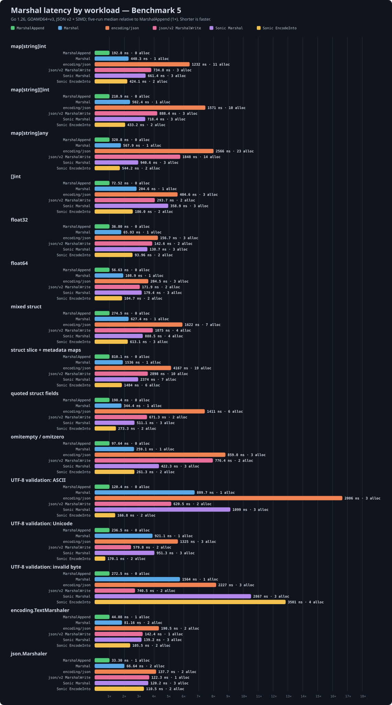

# json-experiment

An experimental, performance-focused JSON marshaler for Go.

## Benchmarks

Benchmark 5 compares:

- `MarshalAppend`, which reuses caller-provided destination capacity.
- `Marshal`, which returns an independently owned byte slice.
- Go's `encoding/json`.
- Go's experimental `encoding/json/v2` using `MarshalWrite`.
- `sonic.ConfigFastest.Marshal`.
- Sonic's reusable-buffer `EncodeInto` API.

For like-for-like comparisons, `MarshalAppend` corresponds to `MarshalWrite`
and `EncodeInto`, while `Marshal` corresponds to the marshal APIs that return
owned output. The append path can avoid output allocation when the destination
has sufficient capacity.

### Benchmark 5

This is a five-run median on Go 1.26 using `GOAMD64=v3` with the JSON v2 and
SIMD experiments enabled. The suite includes maps, primitive slices, numbers,
struct variants, UTF-8 validation, and standard marshaling interfaces.



```sh
GOAMD64=v3 GOEXPERIMENT=jsonv2,simd go test \
  -benchmem -run='^$' -count=5 -bench='^Benchmark' .
```

Five-run median latency (lower is better):

| Workload | MarshalAppend | Marshal | encoding/json | json/v2 Write | Sonic Marshal | Sonic EncodeInto |
|---|---:|---:|---:|---:|---:|---:|
| `map[string]int` | 192.8 ns | 440.3 ns | 1232 ns | 734.8 ns | 661.4 ns | 424.1 ns |
| `map[string][]int` | 210.9 ns | 502.4 ns | 1571 ns | 888.4 ns | 718.4 ns | 433.2 ns |
| `map[string]any` | 320.8 ns | 567.9 ns | 2566 ns | 1848 ns | 940.6 ns | 544.2 ns |
| `[]int` | 72.52 ns | 204.6 ns | 404.6 ns | 293.7 ns | 358.9 ns | 186.0 ns |
| `float32` | 36.80 ns | 65.93 ns | 156.7 ns | 142.6 ns | 130.7 ns | 93.96 ns |
| `float64` | 56.63 ns | 108.9 ns | 204.5 ns | 171.9 ns | 179.4 ns | 104.7 ns |
| mixed struct | 274.5 ns | 627.4 ns | 1622 ns | 1075 ns | 888.5 ns | 613.1 ns |
| struct slice with metadata maps | 810.1 ns | 1536 ns | 4167 ns | 2898 ns | 2374 ns | 1484 ns |
| quoted struct fields | 190.4 ns | 344.4 ns | 1411 ns | 671.3 ns | 511.1 ns | 273.3 ns |
| `omitempty` / `omitzero` | 97.64 ns | 259.1 ns | 859.0 ns | 776.4 ns | 422.3 ns | 261.3 ns |
| UTF-8 validation: ASCII | 120.4 ns | 809.7 ns | 2006 ns | 620.5 ns | 1099 ns | 166.8 ns |
| UTF-8 validation: Unicode | 236.5 ns | 921.1 ns | 1325 ns | 579.8 ns | 951.3 ns | 170.1 ns |
| UTF-8 validation: invalid byte | 272.5 ns | 1564 ns | 2227 ns | 740.5 ns | 2867 ns | 3501 ns |
| `encoding.TextMarshaler` | 44.08 ns | 81.16 ns | 190.5 ns | 142.4 ns | 139.2 ns | 105.5 ns |
| `json.Marshaler` | 33.30 ns | 66.64 ns | 137.7 ns | 122.3 ns | 120.2 ns | 110.5 ns |

Median allocations per operation:

| Workload | MarshalAppend | Marshal | encoding/json | json/v2 Write | Sonic Marshal | Sonic EncodeInto |
|---|---:|---:|---:|---:|---:|---:|
| `map[string]int` | 0 | 1 | 11 | 3 | 3 | 2 |
| `map[string][]int` | 0 | 1 | 10 | 3 | 3 | 2 |
| `map[string]any` | 0 | 1 | 23 | 14 | 3 | 2 |
| `[]int` | 0 | 1 | 3 | 2 | 3 | 2 |
| `float32` | 0 | 1 | 3 | 2 | 3 | 2 |
| `float64` | 0 | 1 | 3 | 2 | 3 | 2 |
| mixed struct | 0 | 1 | 7 | 4 | 4 | 3 |
| struct slice with metadata maps | 0 | 1 | 19 | 10 | 7 | 6 |
| quoted struct fields | 0 | 1 | 6 | 2 | 3 | 2 |
| `omitempty` / `omitzero` | 0 | 1 | 3 | 2 | 3 | 2 |
| UTF-8 validation: ASCII | 0 | 1 | 3 | 2 | 3 | 2 |
| UTF-8 validation: Unicode | 0 | 1 | 3 | 2 | 3 | 2 |
| UTF-8 validation: invalid byte | 0 | 1 | 3 | 2 | 3 | 4 |
| `encoding.TextMarshaler` | 1 | 2 | 2 | 1 | 3 | 2 |
| `json.Marshaler` | 1 | 2 | 2 | 1 | 3 | 2 |

The custom `MarshalerAppend` precedence benchmark only applies to this
package. Its median results were 16.74 ns with zero allocations for
`MarshalAppend`, and 47.32 ns with one allocation for `Marshal`.

The complete Benchmark 5 output, including bytes and allocations per
operation, is available in [`bench5.txt`](assets/benchmarks/raw/bench5.txt).
Benchmarks 1–4 and their original commentary are preserved in
[`README-old.md`](README-old.md).

---

Results vary by hardware, Go version, and workload. Run the benchmarks on the
target system before drawing conclusions for a particular application.
